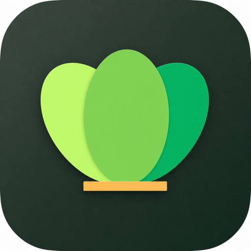

<p align="center">
  
</p>

<h1 align="center">LeafOrLeave</h1>

<p align="center">
  <strong>Ruang browsing dan produktivitas native yang dirancang khusus untuk macOS.</strong>
</p>

<p align="center">
  Workspaces terpisah, tab cerdas, kontrol media, perlindungan sesi,
  dan password vault dalam satu pengalaman yang tenang dan terorganisasi.
</p>

<p align="center">
  
  
  
  
  
</p>

---

## Tentang LeafOrLeave

LeafOrLeave adalah aplikasi macOS native untuk mengatur aktivitas browsing berdasarkan konteks. Setiap workspace memiliki tab, pilihan tab aktif, pin, warna, ikon, dan halaman awalnya sendiri sehingga aktivitas belajar, pengembangan, media, dan kebutuhan pribadi tidak bercampur.

Aplikasi dibangun dengan SwiftUI, WebKit, dan framework sistem macOS. LeafOrLeave tidak menggunakan dependency pihak ketiga pada runtime aplikasinya.

> [!NOTE]
> LeafOrLeave masih berada dalam tahap pengembangan aktif. Fitur utama telah tersedia dan memiliki pengujian otomatis, tetapi distribusi publik tetap membutuhkan pengujian website nyata, audit performa, signing, dan notarization.

## Sorotan Utama

| Area | Kemampuan |
|---|---|
| **Workspaces** | Lingkungan terpisah dengan tab, pin, ikon, warna, home page, dan urutan tersendiri |
| **Tabs** | Create, close, duplicate, reopen, reorder, pin, pencarian tab, dan session restore |
| **Passwords** | macOS Keychain, autentikasi perangkat, autofill, multi-account picker, serta save/update otomatis |
| **Performance** | Smart Tab Suspension, memory-pressure monitoring, lifecycle metrics, dan manual optimization |
| **Network** | Status koneksi, latency monitor, local-network routing, serta recovery overlay |
| **Media** | Deteksi media per tab, play/pause, mute, seek, mini-player, dan equalizer |
| **Downloads** | Progress, ukuran file, destination picker, safe filename, open, dan reveal in Finder |
| **Developer** | Console, JavaScript evaluation, Web Inspector, operational logging, dan diagnostics report |

## Pengalaman Aplikasi

### Navigasi dan Tab

- Toolbar native dengan address field, navigation controls, status jaringan, serta download activity.
- Tab bar dengan favicon, loading state, audio indicator, close target yang konsisten, dan tab search.
- Dukungan popup, authentication window, local file, zoom, hard reload, dan keyboard navigation.
- New Tab page dengan quick links, recent activity, serta identitas workspace aktif.

### Workspaces

- Workspace bawaan untuk Study, Coding, dan Media.
- Workspace custom dengan nama, simbol, accent color, dan home page.
- Tab benar-benar dipetakan dan dipertahankan per workspace.
- Selected tab dan pinned tab disimpan secara independen.
- Workspace editor untuk membuat, mengubah, mengurutkan, dan menghapus workspace.

### Passwords dan Website Sessions

- Credential disimpan di macOS Keychain.
- Password vault dibuka menggunakan Touch ID atau kata sandi Mac.
- Dukungan reveal, copy, edit, update, dan delete credential.
- Password yang disalin dibersihkan otomatis dari clipboard setelah 60 detik.
- Autofill mendukung beberapa akun dan alur login bertahap.
- Current password, new password, dan verification code ditangani secara terpisah.
- Tawaran Save/Update ditampilkan setelah terdapat indikasi login berhasil.
- Website data menggunakan persistent data store agar sesi dapat bertahan setelah aplikasi ditutup.

### Performance

- Lifecycle tab: `active`, `background`, `sleeping`, `frozen`, dan `discarded`.
- Smart suspension berdasarkan idle timeout, tingkat agresivitas, dan memory pressure.
- Playing media, mini-player, pinned tab, download, upload, serta protected tab dapat dikecualikan.
- Performance panel menampilkan status tab dan hasil evaluasi terakhir.
- Tombol **Optimize Now** tersedia untuk optimasi manual.

### Network dan Exam Protection

- Pemantauan konektivitas menggunakan `Network.framework`.
- Pengukuran latency dan status jaringan langsung pada toolbar/sidebar.
- Resolusi alamat perangkat lokal dan fallback koneksi khusus local network.
- Recovery overlay membantu menjaga konteks ketika koneksi terputus.
- Protected tab mendapatkan konfirmasi sebelum ditutup atau aplikasi dihentikan.
- Form snapshot hanya menangani field aman dan tidak merekam password, hidden field, file, atau payment field.

> [!IMPORTANT]
> Exam Protection tidak dapat memperpanjang timeout server, menjamin jawaban tersimpan, atau menggantikan autosave milik website. Gunakan backup dan ikuti prosedur resmi platform yang digunakan.

### Media dan Downloads

- Status audio/video diperbarui per tab.
- Kontrol play, pause, mute, seek, dan mini-player.
- Equalizer eksperimental untuk media HTML5 yang kompatibel.
- Download toast, toolbar progress, riwayat download, dan destination picker.
- File dapat dibuka langsung atau ditampilkan di Finder.

### Settings dan Personalisasi

- Settings dengan navigasi terstruktur dan pencarian.
- Pengaturan General, Tabs, Workspaces, Performance, Network, Exam Protection, Media, Privacy, Appearance, Developer, dan Advanced.
- Theme preview, accent color, interface density, animation style, dan toolbar customization.
- Editor quick links untuk New Tab page.
- Diagnostics metrics dapat dinonaktifkan dan dibersihkan dari memori.

## Privasi dan Keamanan

LeafOrLeave memisahkan credential, website session, dan diagnostics:

- Password hanya disimpan pada macOS Keychain.
- Pembukaan vault memerlukan autentikasi pemilik perangkat.
- Password tidak ditulis ke Settings atau diagnostics report.
- Operational logs tidak menyertakan URL, cookies, form content, credential, atau authentication token.
- Diagnostic event buffer dibatasi untuk mencegah pertumbuhan memori tanpa batas.
- App Sandbox, network client, camera, microphone, selected files, dan Downloads entitlements dideklarasikan secara eksplisit.

Jangan membuka issue publik yang mengandung password, token, jawaban ujian, cookie, atau data pribadi.

## Persyaratan Pengembangan

- macOS 14 atau lebih baru.
- Xcode yang kompatibel dengan SDK proyek.
- Swift 5 atau versi Swift yang disediakan Xcode.
- Apple Development Team untuk menjalankan build dengan signing.

## Menjalankan Proyek

1. Clone repository:

   ```bash
   git clone https://github.com/Bapakardhie93/LeaforLeave.git
   cd LeaforLeave
   ```

2. Buka `LeafOrLeave.xcodeproj`.
3. Pilih scheme **LeafOrLeave** dan destination **My Mac**.
4. Pilih Signing Team milik Anda.
5. Jalankan aplikasi menggunakan `⌘R`.

Build tanpa code signing:

```bash
xcodebuild \
  -project LeafOrLeave.xcodeproj \
  -scheme LeafOrLeave \
  -configuration Debug \
  -destination 'platform=macOS' \
  build CODE_SIGNING_ALLOWED=NO
```

Menjalankan unit test:

```bash
xcodebuild test \
  -project LeafOrLeave.xcodeproj \
  -scheme LeafOrLeave \
  -destination 'platform=macOS' \
  -only-testing:LeafOrLeaveTests \
  CODE_SIGNING_ALLOWED=NO
```

Menjalankan UI test utama:

```bash
xcodebuild test \
  -project LeafOrLeave.xcodeproj \
  -scheme LeafOrLeave \
  -destination 'platform=macOS' \
  -only-testing:LeafOrLeaveUITests/LeafOrLeaveUITests/testModernSettingsNavigation
```

## Struktur Proyek

```text
LeafOrLeave/
├── App/                    # App lifecycle dan dependency environment
├── Core/
│   ├── Browser/            # WebView configuration dan lifecycle
│   ├── Logging/            # Operational log dan bounded diagnostics buffer
│   ├── Networking/         # Connectivity monitoring dan recovery
│   ├── Persistence/        # Session persistence
│   └── Utilities/          # Formatter dan secure clipboard
├── DesignSystem/
│   ├── Colors/             # Semantic color dan theme
│   ├── Components/         # Reusable native components
│   ├── Layout/             # Window metrics dan spacing
│   └── Typography/         # Shared typography tokens
└── Features/
    ├── Browser/            # Browser shell, menus, console, dan network HUD
    ├── Downloads/          # Download manager, list, dan toast
    ├── Equalizer/          # Web Audio equalizer
    ├── ExamProtection/     # Protected tab dan recovery
    ├── Library/            # Bookmarks dan history surfaces
    ├── Media/              # Media bridge dan mini panel
    ├── Omnibox/            # Address and search resolution
    ├── Passwords/          # Keychain vault, capture, dan autofill
    ├── Performance/        # Suspension, memory pressure, dan inspector
    ├── Settings/           # Typed settings dan modern panels
    ├── Sidebar/            # Workspace dan library navigation
    ├── Tabs/               # Tab model, manager, bar, dan search
    └── Workspace/          # Workspace model dan persistence
```

## Shortcut Utama

| Shortcut | Aksi |
|---|---|
| `⌘T` | Membuat tab baru |
| `⌘W` | Menutup tab aktif |
| `⌘⇧T` | Membuka kembali tab terakhir |
| `⌘L` | Fokus ke address field |
| `⌃Tab` / `⌃⇧Tab` | Berpindah ke tab berikutnya/sebelumnya |
| `⌘⇧A` | Mencari tab yang terbuka |
| `⌘1…⌘9` | Memilih tab berdasarkan posisi |
| `⌘⇧[` / `⌘⇧]` | Memindahkan tab ke kiri/kanan |
| `⌘⇧1…⌘⇧3` | Berpindah ke workspace bawaan |
| `⌘⇧S` | Menampilkan atau menyembunyikan sidebar |
| `⌘⇧R` | Hard reload |

## Roadmap

Prioritas pengembangan berikutnya:

- Audit lifecycle dan penggunaan memori menggunakan Instruments.
- Pengujian sign-in, popup authentication, download besar, disk penuh, dan jaringan putus-sambung pada website nyata.
- Download resume, retry, speed reporting, dan penanganan storage error.
- History, bookmarks, serta per-site data management yang lebih lengkap.
- Accessibility audit untuk VoiceOver, keyboard-only navigation, contrast, dan reduced motion.
- Localization Bahasa Indonesia dan English.
- CI untuk build, test, static checks, dan release artifact.
- Hardened runtime, notarization, packaging, dan distribusi beta.

## Kontribusi

Issue dan pull request dipersilakan. Untuk perubahan besar, sertakan:

1. Masalah dan behavior yang diharapkan.
2. Langkah reproduksi.
3. Versi macOS dan Xcode.
4. Dampak performa, privasi, atau keamanan.
5. Test untuk behavior baru.

Jangan commit token, cookie, credential, `DerivedData`, atau `xcuserdata`.

## Lisensi

Lisensi open-source belum ditentukan. Sampai file `LICENSE` ditambahkan, seluruh hak tetap dimiliki oleh pemilik repository dan penggunaan ulang belum otomatis diizinkan.

## Brand

Nama, identitas visual, dan AppIcon LeafOrLeave merupakan aset asli milik pemilik proyek.
